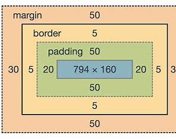
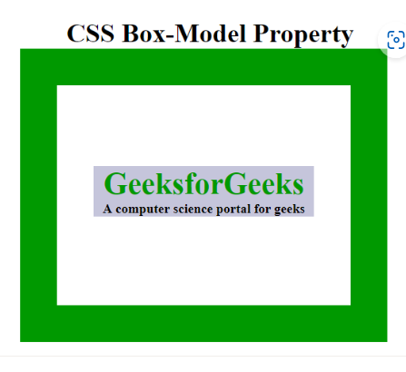

<!-- DON'T EDIT THIS SECTION, INSTEAD RE-RUN doctoc TO UPDATE -->
**Table of Contents**  *(https://github.com/thlorenz/doctoc)*

- [css box model](#css-box-model)
  - [what is it](#what-is-it)
    - [Content:](#content)
      - [Padding:](#padding)
      - [Border](#border)
      - [Margin:](#margin)
  - [How Does the Box Model Work?](#how-does-the-box-model-work)

<!-- END doctoc generated TOC please keep comment here to allow auto update -->

# css box model
## what is it
The CSS box model is fundamental to how elements are rendered on web pages. It consists of several parts:


 ### Content: 
 This is the actual content of the box, such as text, images, etc.

#### Padding:
 The space between the content and the border. Padding helps to create space inside the box and around its content.

#### Border
 A border that goes around the padding and content. It can be styled in various ways, such as solid, dashed, etc.

#### Margin:
 The space outside the border. Margins are used to create space between elements. They don't have a background color or border, but they affect the layout of elements on the page

## How Does the Box Model Work?
When setting the width and height properties for an element, we’re mainly adjusting the content area. However, to calculate the full size of the element, we need to consider padding and borders also.

While setting the width and height properties of an element with CSS, we have only set the width and height of the content area. We need to add padding and borders in order to calculate the full size of an element. Although margin affects the total area an element takes on the page but it is not considered to be a part of the actual size of the box as margins show peculiar behaviors like margin collapsing. Consider the below example.

## EXAMPLES
```css
p {
    width: 80px;
    height: 70px;
    margin: 0;
    border: 2px solid black;
    padding: 5px;
}

```

This example illustrates the use of the CSS Box model for aligning & displaying it properly.

```html
<!DOCTYPE html>
<html>

<head>
    <title>CSS Box Model</title>
    <style>
        .main {
            font-size: 36px;
            font-weight: bold;
            Text-align: center;
        }
        
        .gfg {
            margin-left: 60px;
            border: 50px solid #009900;
            width: 300px;
            height: 200px;
            text-align: center;
            padding: 50px;
        }
        
        .gfg1 {
            font-size: 42px;
            font-weight: bold;
            color: #009900;
            margin-top: 60px;
            background-color: #c5c5db;
        }
        
        .gfg2 {
            font-size: 18px;
            font-weight: bold;
            background-color: #c5c5db;
        }
    </style>
</head>

<body>
    <div class="main">
        CSS Box-Model Property
    </div>

    <div class="gfg">
        <div class="gfg1">
            Geeks for Geeks
        </div>

        <div class="gfg2">
            A computer science portal for geeks
        </div>
    </div>
</body>

</html>
```

